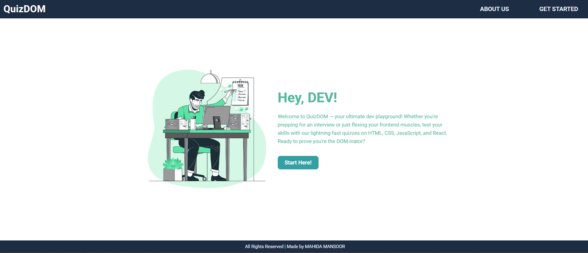
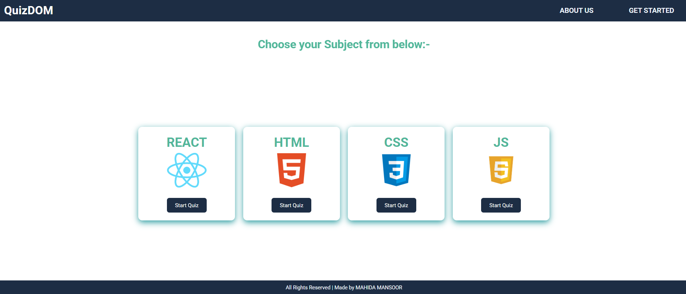
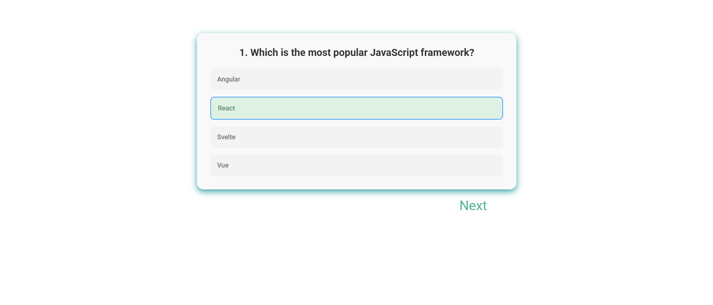
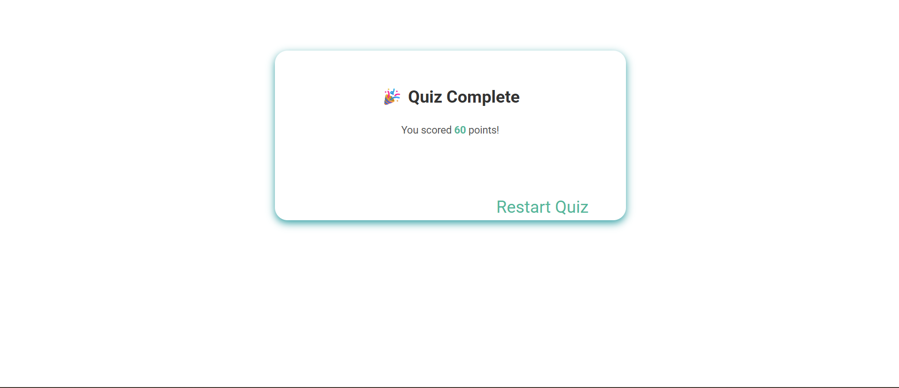

QuizDOM:

> **Live Demo:** [https://quiz-dom-eight.vercel.app](https://quiz-dom-eight.vercel.app)

QuizDOM is an interactive quiz application built with React and Vite, designed to help developers test their knowledge in a fun and engaging way.
The app features smooth animations, optimized state management, and a seamless user experience.

Features:
Animated UI: Smooth entrance animations and transitions powered by Framer Motion.
Subject Selection: Choose from React, HTML, CSS, or JavaScript.

Dynamic Quiz Engine:
Instant feedback with color-coded results (✅ Green / ❌ Red).
Score tracking based on question points.

Optimized Performance: Direct JSON data bundling for instant loading (No external API latency).

Routing & Safety:
Client-side routing using React Router.
Custom 404 Page for invalid URLs.
Prevention of accidental refreshes during an active quiz session.

Tech Stack:
React 19 (Context API + useReducer)
Vite (Build Tool)
Framer Motion (Animations)
React Router DOM (Navigation)
Tailwind CSS / CSS Modules (Styling)

Getting Started (Local Setup):
Follow these steps to run the project locally:

1️⃣ Clone the Repository

git clone https://github.com/your-username/QuizDOM.git
cd QuizDOM

2️⃣ Install Dependencies

npm install

3️⃣ Run the App

npm run dev
The app will run at: http://localhost:5173

Note: This version of QuizDOM uses bundled data located in src/data/questions.json. You do not need to run a separate JSON server.

## 🖼️ Screenshots

  
  

  
  

Built with ❤️ by Mahida
